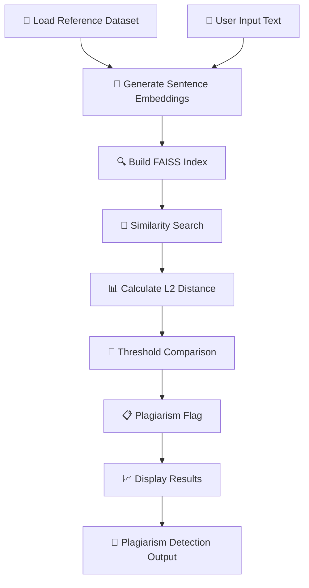

<div align="center">

# 📝 Plagiarism Detection

# NLP Powered Semantic Similarity Detection System

## Detect Copying. Protect Originality. Ensure Integrity. 🛡️

</div>

---

<p align="center">


</p>

---

# 📖 Project Description

The **Plagiarism Detection System** is a Python-based application that detects copied or paraphrased text using semantic similarity instead of simple keyword matching. Built with modern Natural Language Processing (NLP) techniques, this tool identifies whether two pieces of text convey the same meaning even if the wording is changed.

It helps students, teachers, researchers, and developers automatically check documents for plagiarism in a smarter and more reliable way.

---

# ✨ Key Highlights

- 📝 Semantic Similarity Based Detection
- 🔍 Detects Paraphrased & Rewritten Text
- 📊 Adjustable Plagiarism Threshold
- 🎯 Nearest Matching Sentences Display
- 🚨 Flags Suspected Copied Content
- 🎨 Simple Web-Based Interface
- 📁 CSV-Based Dataset Support
- ⚡ Fast FAISS Similarity Search
- 🧠 Pre-Trained Sentence Embeddings
- 🌐 No Training Required

---

# 🏗 System Architecture

The Plagiarism Detection System follows a modular NLP pipeline that transforms text into semantic embeddings and performs fast similarity search using FAISS to identify plagiarized content.



---

### 🔄 Application Workflow

1. Load CSV file (www.csv) with reference text columns.
2. Generate embeddings for all sentences using Sentence-Transformers.
3. Build FAISS similarity index for fast retrieval.
4. User pastes text into the application.
5. System generates embedding for input text.
6. FAISS performs similarity search against the database.
7. System calculates semantic distance (L2 distance).
8. Threshold-based comparison determines plagiarism.
9. Results are displayed with similarity scores and flags.

---

# 📊 Feature Comparison

| Feature | Keyword Matching | Semantic Similarity |
|:---|:---:|:---:|
| Exact Copy Detection | ✅ | ✅ |
| Paraphrase Detection | ❌ | ✅ |
| Rewritten Text Detection | ❌ | ✅ |
| Word Substitution Detection | ❌ | ✅ |
| Meaning-Based Comparison | ❌ | ✅ |
| Fast Search | ✅ | ✅ |
| Adjustable Threshold | ❌ | ✅ |
| Semantic Understanding | ❌ | ✅ |

---

# ✨ Core Features

## 🧠 Semantic Similarity Detection
- Meaning-based text comparison
- Paraphrase detection
- Rewritten content identification
- Word substitution resilience

---

## 📊 Adjustable Plagiarism Threshold

| Threshold | Sensitivity | Use Case |
|:---|:---:|:---|
| Low (0.3) | High Sensitivity | Strict plagiarism detection |
| Medium (0.5) | Balanced | General purpose |
| High (0.7) | Low Sensitivity | Lenient checking |

---

## 🔍 FAISS Similarity Search
- Fast nearest-neighbor search
- L2 distance calculation
- Scalable to large datasets
- Efficient vector retrieval

---

## 🎯 Nearest Matching Sentences
- Displays closest matches
- Shows similarity scores
- Contextual comparison
- Transparent results

---

## 📁 CSV Dataset Support
- Easy dataset loading
- Flexible text columns
- Scalable reference database
- Simple updates

---

## 🚨 Plagiarism Flagging
- Clear plagiarism indicators
- Color-coded results
- Confidence-based detection
- Actionable insights

---

# 🛠 Technology Stack

| Layer | Technology |
|:---|:---|
| Programming Language | Python 3.11 |
| User Interface | Streamlit |
| Embeddings | Sentence-Transformers (all-MiniLM-L6-v2) |
| Similarity Search | FAISS |
| Data Processing | Pandas + NumPy |
| Model | Pre-trained (No Training Required) |
| Deployment | Streamlit Cloud / Local |
| Version Control | Git & GitHub |

---

# 📂 Project Structure

```text
PLAGIARISM-DETECTION-USING-NLP/
│
├── plagiarism_app.py                   # Main Streamlit Application
├── requirements.txt                    # Dependencies
├── README.md                           # Documentation
├── .gitignore                          # Git Ignore
├── code.txt                            # Code Snippets
│
├── plagiarism_dataset.csv              # Reference Dataset
├── WWW.CSV                             # Alternative Dataset
│
└── plag_env/                           # Virtual Environment
```

---

# 📸 Application Preview


The screenshots above demonstrate the Plagiarism Detection System's complete workflow—from text input and semantic embedding generation to FAISS similarity search, threshold-based plagiarism detection, and result visualization.


---

# ⚙ Installation

## Prerequisites

- Python 3.11+
- pip

---

### Clone Repository

```bash
git clone https://github.com/Keya3639/PLAGIARISM-DETECTION-USING-NLP.git

cd PLAGIARISM-DETECTION-USING-NLP
```

---

### Create Virtual Environment

```bash
python -m venv plag_env

# Windows
plag_env\Scripts\activate

# macOS/Linux
source plag_env/bin/activate
```

---

### Install Dependencies

```bash
pip install -r requirements.txt
```

---

### Run Application

```bash
streamlit run plagiarism_app.py
```

---

### Alternative Execution

```bash
python plagiarism_app.py
```

---

# 🚀 Demo Workflow

| Step | Action |
|:--:|:---|
| 1 | Load Reference Dataset (CSV) |
| 2 | System Generates Embeddings |
| 3 | Build FAISS Index |
| 4 | Paste Text to Check |
| 5 | Click "Check Plagiarism" |
| 6 | View Similarity Score |
| 7 | Check Plagiarism Flag |
| 8 | Review Nearest Matches |

---

# 🌟 Why Plagiarism Detection?

Unlike traditional keyword-based plagiarism checkers, the **Plagiarism Detection System** leverages **Semantic Similarity** through Sentence Embeddings to identify meaning-based plagiarism, including paraphrased and rewritten content.

This system helps:

- 📝 Detect plagiarism beyond exact copy-paste
- 🔍 Identify paraphrased and rephrased content
- ⚡ Perform fast similarity searches with FAISS
- 🎯 Provide adjustable thresholds for different use cases
- 🧠 Use pre-trained models (no training required)

**Plagiarism Detection doesn't just match words—it understands meaning.**

---

# 📈 Advantages

- ✅ Detects plagiarism beyond exact copy-paste
- ✅ Works for paraphrasing and sentence rephrasing
- ✅ Fast search with FAISS indexing
- ✅ Simple interface usable by non-technical users
- ✅ Can expand with more datasets easily
- ✅ Uses pre-trained models (no training required)
- ✅ Semantic understanding for accurate detection

---

# ⚠️ Limitations

- Requires good quality reference database
- Threshold tuning is sometimes subjective
- May give false positives for very common sentences
- Performance depends on hardware when indexing large datasets
- Not a legal plagiarism proof tool — acts as a detection assistant

---

# 🌟 Real-Time Applications

- 🎓 Education: Check assignments, reports, and research submissions
- 🔬 Research: Verify originality in academic papers
- 📰 Publishing: Detect copied article or blog content
- 🏢 Corporate: Prevent duplicate documentation
- 📊 Content moderation: Identify reused or auto-generated text

---

# 🔮 Future Enhancements

| Phase | Features |
|:---|:---|
| Phase 1 | Support for document uploads (PDF, DOCX, TXT) |
| Phase 2 | Highlight plagiarized sections inside text |
| Phase 3 | Larger language model integration |
| Phase 4 | Multi-language plagiarism detection |
| Phase 5 | Backend database storage instead of CSV |
| Phase 6 | Export plagiarism report as PDF |
| Phase 7 | Web deployment (Cloud/HuggingFace/Streamlit Cloud) |

---

# 🛣 Roadmap

- ✅ Semantic Similarity Detection
- ✅ Sentence-Transformers Integration
- ✅ FAISS Similarity Search
- ✅ Adjustable Threshold
- ✅ Streamlit Interface
- 🔄 Document Upload Support
- 🔄 Section Highlighting
- 🔄 Multi-Language Support

---

# 🎯 Conclusion

The **Plagiarism Detection System** provides an intelligent approach to plagiarism checking by focusing on meaning instead of exact wording. Using sentence embeddings and FAISS similarity search, it is capable of identifying paraphrased and modified text effectively.

With further development, it can become a highly reliable plagiarism analysis tool for academic, professional, and research environments.

---

# 👩‍💻 Developer

## Keya Das

**MCA (Artificial Intelligence & Data Science)**

🌐 **GitHub**

https://github.com/Keya3639

📧 **Email**

keyakarunamoydas@gmail.com

---

# 🙏 Acknowledgements

This project was developed using the following open-source technologies and frameworks:

- 🧠 Sentence-Transformers
- 🔎 FAISS
- 🎨 Streamlit
- 🐍 Python
- 🐼 Pandas
- 📊 NumPy
- 🌍 Open Source Community

---

<div align="center">

# 📝 Plagiarism Detection

### Detect Copying. Protect Originality. Ensure Integrity. 🛡️

<br>

**Built with ❤️ using**

**Python • Streamlit • Sentence-Transformers • FAISS • Pandas • NumPy**

<br>

</div>
